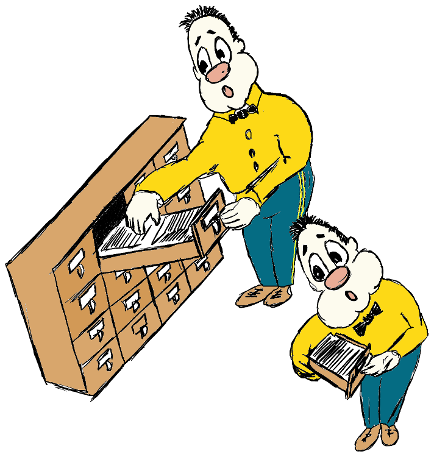

Catalog 
================

This application is a universal catalog.
This application I am writing to reduce the time searching for the right things to me. When I say a thing, I mean a piece of software code and tools in the home workshop and favorite music and food in the kitchen.

In the initial stage this application was generated with the [rails_apps_composer](https://github.com/RailsApps/rails_apps_composer) gem
provided by the [RailsApps Project](http://railsapps.github.io/).

Ruby on Rails
-------------

This application requires:

- Ruby 2.2.3
- Rails 4.2.4

Learn more about [Installing Rails](http://railsapps.github.io/installing-rails.html).

Getting Started
---------------

Documentation and Support
-------------------------

Contributing
------------

License
-------

Copyright
-------
Copyright (c) 2015 Alexander Ponikarovsky
